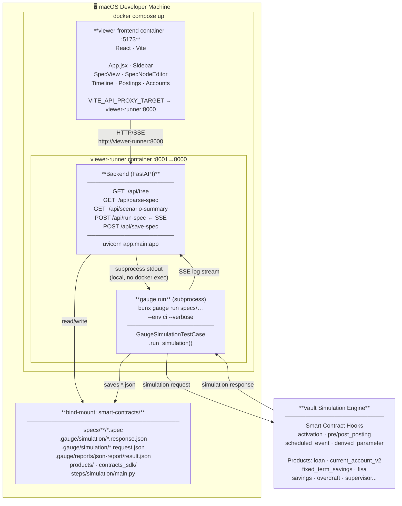
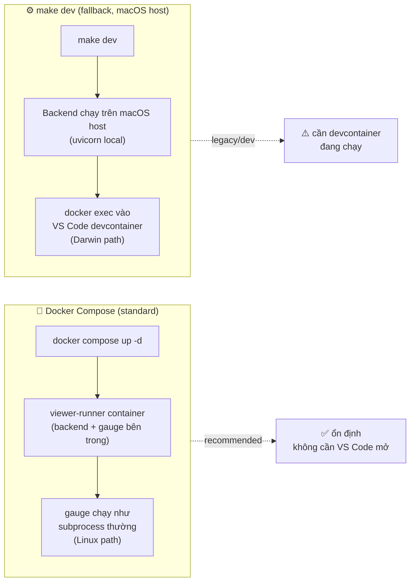
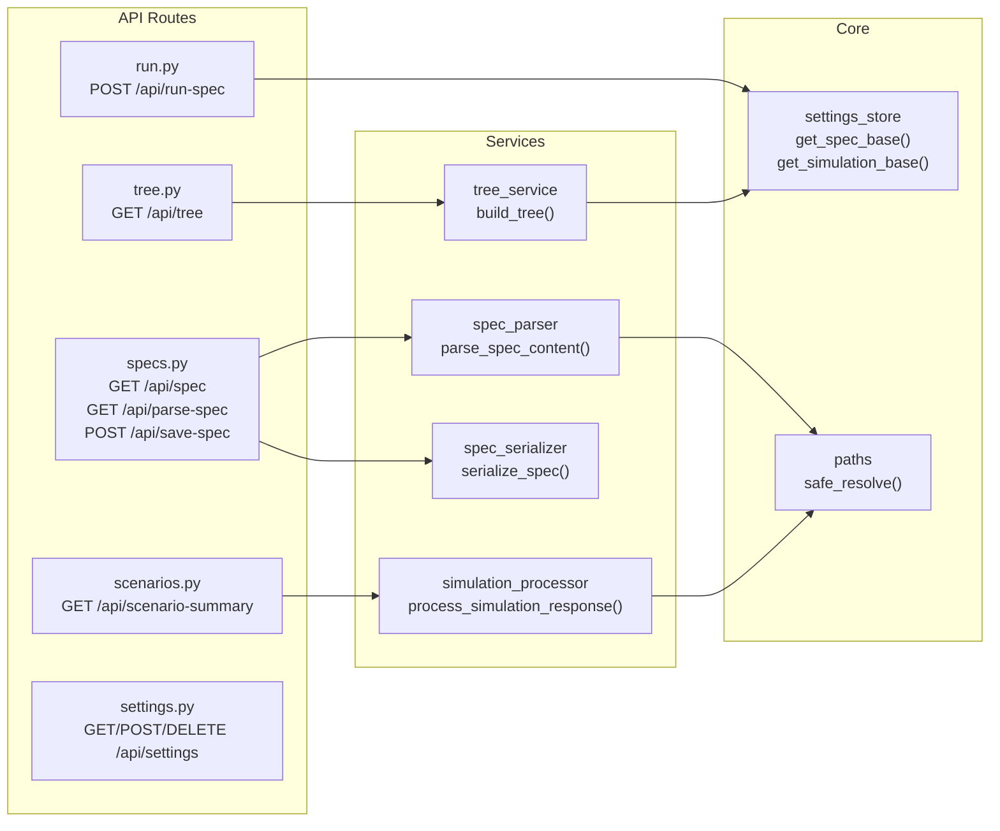
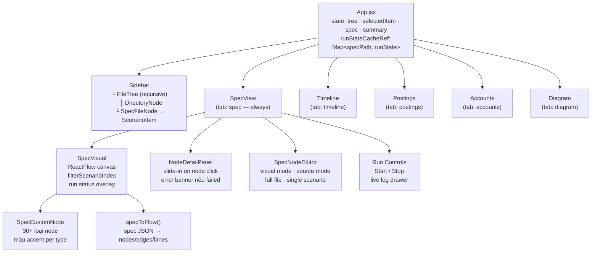
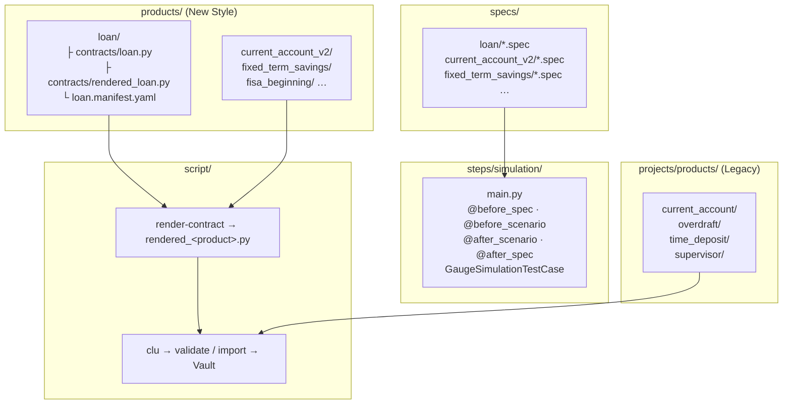
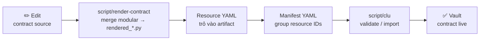
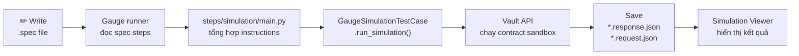
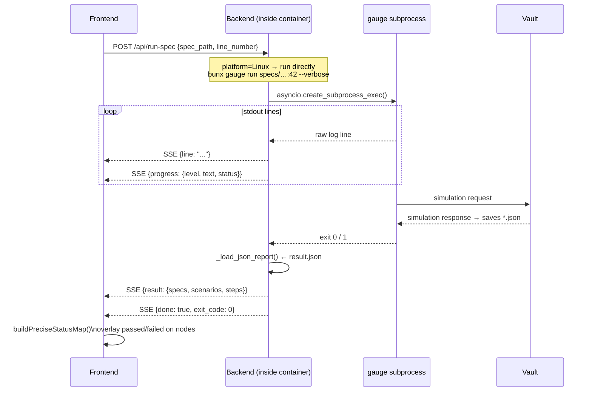
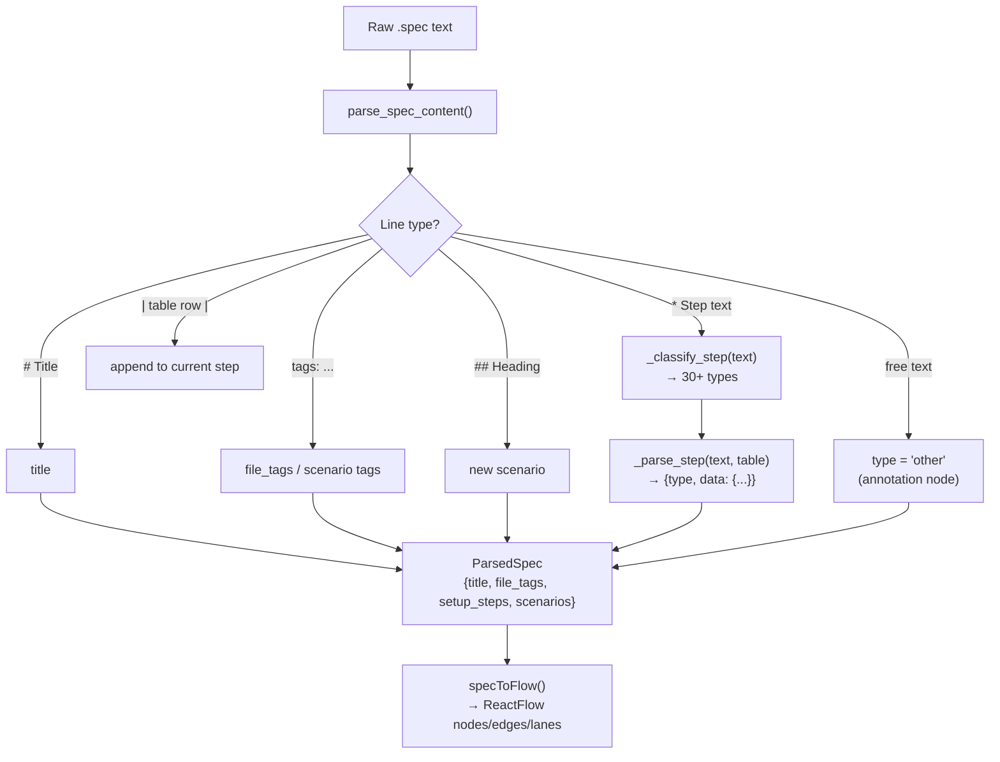
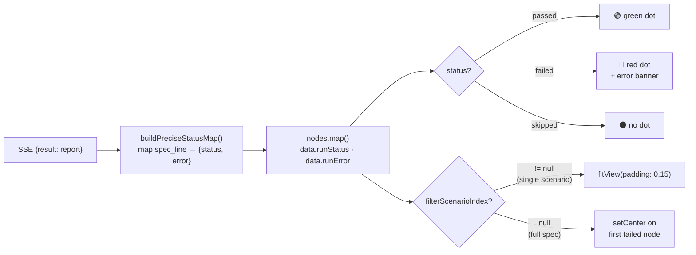

# Kiến Trúc Hệ Thống

## System Architecture

> **Lưu ý**: Cách cũ (backend chạy trên macOS host → `docker exec` vào VS Code devcontainer) vẫn còn trong code tại `run.py` như fallback khi chạy `make dev` không qua Docker. Cách mới (docker compose) là standard — backend chạy thẳng trong container Linux nên gauge là local subprocess bình thường.

---

## Hai Cách Chạy

---

## Component Diagram — Backend

---

## Component Diagram — Frontend

---

## Component Diagram — Smart Contracts

---

## Deploy Pipeline

---

## Test / Simulation Pipeline

---

## Run Spec — SSE Stream Flow

---

## Spec Parse Pipeline

---

## Node Status After Run

