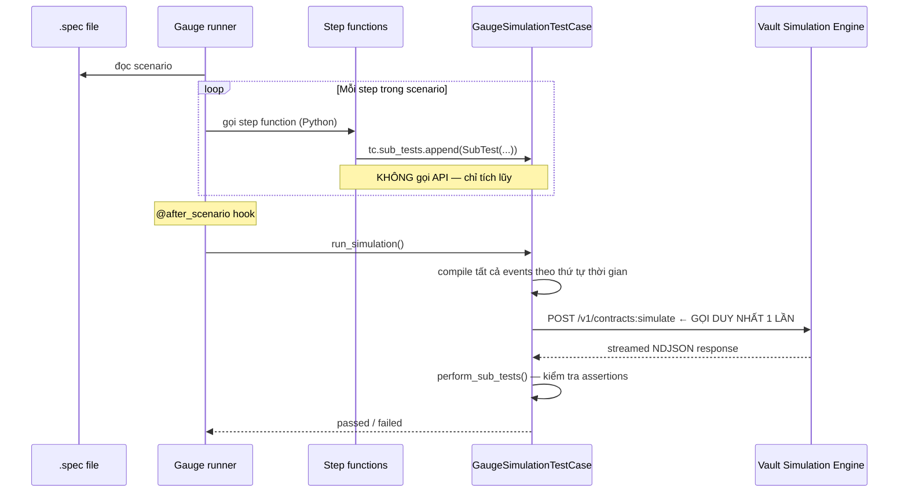

# Phân Tích: Cơ Chế Chạy Simulation

> **TL;DR** — Mỗi kịch bản (scenario) trong `.spec` chỉ gọi **đúng một lần** Vault API duy nhất sau khi tất cả các bước đã được thu thập xong. Các bước trong spec không tự gọi API — chúng chỉ xây dựng danh sách events và assertions rồi đợi `@after_scenario` kích hoạt lời gọi API thật sự.

---

## 1. Tổng Quan Flow



---

## 2. Các Thành Phần Liên Quan

| File | Vai trò |
|------|---------|
| `specs/**/*.spec` | Định nghĩa test scenario bằng cú pháp Gauge BDD |
| `steps/simulation/main.py` | Gauge lifecycle hooks (`@before_spec`, `@after_scenario`, …) |
| `steps/simulation/common/types.py` | `GaugeSimulationTestCase`, `SubTest` |
| `steps/simulation/steps/make/*.py` | Step functions tạo events (inbound_hard_settlement, etc.) |
| `steps/simulation/steps/check/*.py` | Step functions tạo assertions (balance checks, etc.) |
| `inception_sdk/.../vault_caller.py` | HTTP client — thực hiện lời gọi API thật |

---

## 3. Step-by-Step: Điều Gì Xảy Ra Khi Chạy Simulation

### Bước 1 — Gauge đọc file .spec

Gauge parser đọc scenario, tìm từng dòng `* step text` và ánh xạ sang Python function tương ứng dựa trên decorator `@step("step text")`.

### Bước 2 — Mỗi step chỉ **ghi vào danh sách**, không gọi API

Ví dụ, step tạo inbound hard settlement (`steps/simulation/steps/make/instructions/inbound_hard_settlement.py`):

```python
# KHÔNG gọi Vault — chỉ append vào sub_tests
test_case.sub_tests.append(
    SubTest(
        description=description,
        events=events  # danh sách SimulationEvent
    )
)
test_case.timestamps.append(instruction.timestamp)
```

Tương tự, step kiểm tra số dư (`steps/simulation/steps/check/balance.py`):

```python
# KHÔNG gọi Vault — chỉ append assertion
test_case.sub_tests.append(
    SubTest(
        description=description,
        expected_balances_at_ts={timestamp: [ExpectedBalanceLine(...)]}
    )
)
```

### Bước 3 — `@after_scenario` kích hoạt `run_simulation()`

Sau khi tất cả steps trong scenario hoàn thành, Gauge chạy `@after_scenario` hook trong `main.py`. Hook này gọi `test_case.run_simulation()`.

### Bước 4 — `run_simulation()` biên dịch toàn bộ events

```python
# types.py — GaugeSimulationTestCase.run_simulation()
def run_simulation(self):
    test_scenario = self.create_simulation_scenario()
    setup_events, supervisor_details, smart_contracts = self.initialize_setup(test_scenario)
    events, derived_param_outputs = self.compile_chrono_events_with_errors(...)

    # MỘT lời gọi API duy nhất
    response = self.client.simulate_smart_contract(
        start_timestamp=test_scenario.start,
        end_timestamp=test_scenario.end,
        contract_codes=contract_codes,
        events=events,         # tất cả events từ mọi SubTest, sắp xếp theo thời gian
        internal_account_ids=internal_accounts,
        ...
    )

    # Sau khi nhận response, kiểm tra assertions
    super().perform_sub_tests(response, test_scenario.sub_tests)
```

### Bước 5 — `perform_sub_tests()` kiểm tra assertions

Vault trả về toàn bộ timeline simulation. `perform_sub_tests()` duyệt qua từng `SubTest` có `expected_balances_at_ts` và so sánh với data trong response.

---

## 4. Cấu Trúc SubTest

```python
@dataclass
class SubTest:
    description: str

    # Một trong hai — không bao giờ cả hai
    events: list[SimulationEvent] | None = None          # instructions gửi cho Vault
    expected_balances_at_ts: dict[datetime, list] | None = None  # assertions
```

Events và assertions được **tách riêng** thành các `SubTest` khác nhau. Khi biên dịch, engine gom tất cả events theo thứ tự thời gian (chronological), bất kể chúng nằm ở SubTest nào.

---

## 5. API Call Chi Tiết

### Endpoint

```
POST {VAULT_BASE_URL}/v1/contracts:simulate
```

`VAULT_BASE_URL` được inject qua biến môi trường khi khởi tạo `Client`, ví dụ:
```
http://localhost:9090
https://vault.internal.finx.com
```

### Headers

```http
POST /v1/contracts:simulate HTTP/1.1
Content-Type: application/json
X-Auth-Token: <vault_auth_token>
grpc-timeout: 360S
```

- **`X-Auth-Token`**: token xác thực với Vault (set khi khởi tạo `Client`)
- **`grpc-timeout`**: mặc định `360S` (6 phút) — simulation phức tạp có thể mất vài phút
- **`Content-Type`**: `application/json`

### Request Body

```json
{
  "start_timestamp": "2024-01-01T00:00:00+00:00",
  "end_timestamp":   "2024-06-01T00:00:00+00:00",

  "smart_contracts": [
    {
      "code": "<toàn bộ source code của contract.py dưới dạng string>",
      "smart_contract_param_vals": {
        "denomination": "VND",
        "interest_rate": "0.08",
        "minimum_balance": "1000000"
      },
      "smart_contract_version_id": "uuid-v4-string"
    }
  ],

  "supervisor_contracts": [
    {
      "code": "<source code của supervisor contract>",
      "supervisor_contract_version_id": "uuid-v4-string"
    }
  ],

  "contract_modules": [
    {
      "code": "<source code của contract module/library>",
      "contract_module_version_id": "uuid-v4-string"
    }
  ],

  "instructions": [
    {
      "timestamp": "2024-01-01T00:00:00+00:00",
      "create_account": {
        "id": "main_account",
        "product_id": "loan",
        "status": "ACCOUNT_STATUS_OPEN",
        "stakeholder_ids": ["customer_id"],
        "instance_param_vals": {
          "loan_amount": "100000000",
          "repayment_day": "1"
        }
      }
    },
    {
      "timestamp": "2024-02-15T10:00:00+00:00",
      "posting_instruction_batch": {
        "client_id": "test-client",
        "client_batch_id": "batch-001",
        "posting_instructions": [
          {
            "client_transaction_id": "txn-001",
            "inbound_hard_settlement": {
              "amount": "5000000",
              "denomination": "VND",
              "target_account": {
                "account_id": "main_account"
              },
              "internal_account_id": "VAULT_ACCOUNT_0"
            }
          }
        ]
      }
    }
  ],

  "outputs": [
    {
      "timestamp": "2024-03-01T00:00:00+00:00",
      "account_ids": ["main_account"]
    }
  ]
}
```

#### Các loại `instructions` phổ biến

| Key | Mô tả |
|-----|-------|
| `create_account` | Tạo account customer với instance params |
| `posting_instruction_batch` | Gửi batch postings (nạp tiền, rút tiền, chuyển khoản) |
| `create_flag` | Bật flag trên account (ví dụ: dormancy, delinquency) |
| `remove_flag` | Tắt flag |
| `update_account` | Cập nhật trạng thái account |
| `create_smart_contract_module_versions_link` | Liên kết contract với modules |

### Response

Response được stream dưới dạng **NDJSON** (Newline-Delimited JSON) — mỗi dòng là một JSON object độc lập:

```jsonl
{"result": {"balances": {"2024-02-15T10:00:01+00:00": {"main_account": {"VND": {"DEFAULT": {"net": "5000000"}}}}}}}
{"result": {"contract_version_id": "uuid", "logs": [{"timestamp": "...", "message": "hook activated"}]}}
{"result": {"posting_instruction_batches": [...]}}
```

Khi có lỗi (contract raise exception, assertion fail trong contract):

```json
{
  "vault_error_code": "INVALID_POSTING",
  "message": "Posting rejected by pre_posting hook: amount exceeds limit",
  "details": [{"field": "amount", "reason": "..."}]
}
```

---

## 6. Ví Dụ Thực Tế: Mapping Spec → API

Cho file spec sau:

```gauge
# Loan Disbursement Test

## Happy path: disburse 100M VND loan
* Create account "main_account" for product "loan" with params
  | param_key    | param_value |
  | loan_amount  | 100000000   |
* Fund account "main_account" with 100000000 VND on "2024-01-02 09:00:00"
* Check balance of "main_account" at "2024-01-02 09:01:00" equals 100000000 VND
```

Pipeline xử lý:

```
Step 1: "Create account..."
  → sub_tests.append(SubTest(events=[SimulationEvent(time=start, event={"create_account": {...}})]))

Step 2: "Fund account..."
  → sub_tests.append(SubTest(events=[SimulationEvent(time=2024-01-02T09:00, event={"posting_instruction_batch": {...}})]))

Step 3: "Check balance..."
  → sub_tests.append(SubTest(expected_balances_at_ts={2024-01-02T09:01: [ExpectedBalance(account_id="main_account", net="100000000")]}))

@after_scenario:
  → compile events: [create_account_event, fund_event]  (lấy từ SubTest có events)
  → POST /v1/contracts:simulate với body đầy đủ
  → nhận response (timeline đầy đủ)
  → kiểm tra balance tại 2024-01-02T09:01 == 100000000 VND
```

---

## 7. Kết Quả Sau Khi Chạy

Vault trả về toàn bộ timeline — mọi thay đổi số dư, log từ contract, posting kết quả — trong một lần. Gauge đọc kết quả này và:

1. **Saves** `*.response.json` và `*.request.json` vào `.gauge/simulation/`
2. **Writes** `.gauge/reports/json-report/result.json` với pass/fail per step
3. Backend (`run.py`) đọc `result.json` và stream kết quả về frontend qua SSE
4. Frontend overlay pass/fail status lên từng node trong SpecView canvas

---

## 8. Timeout và Error Cases

| Tình huống | Kết quả |
|-----------|---------|
| Contract raise `Rejected` exception | `VaultException` với `vault_error_code` |
| Simulation timeout (> 360S) | `grpc-timeout` error, step failed |
| Balance assertion fail | `perform_sub_tests()` raise AssertionError, scenario failed |
| Network error đến Vault | `requests.HTTPError`, scenario failed |
| `afterScenarioHookFailure` | Captured riêng trong json-report, hiển thị trong NodeDetailPanel |

---

## 9. Vault API Client — Khởi Tạo

```python
# Được khởi tạo trong GaugeSimulationTestCase.__init__()
self.client = Client(
    core_api_url=os.environ["VAULT_BASE_URL"],   # ví dụ: http://localhost:9090
    auth_token=os.environ["VAULT_AUTH_TOKEN"],
)

# Client._set_session_headers() tự động set:
# {"X-Auth-Token": auth_token, "Content-Type": "application/json"}
```

Biến môi trường cần set trong `.env` (trong `smart-contracts/` hoặc được inject bởi CI):
- `VAULT_BASE_URL` — URL của Vault simulation endpoint
- `VAULT_AUTH_TOKEN` — token xác thực
